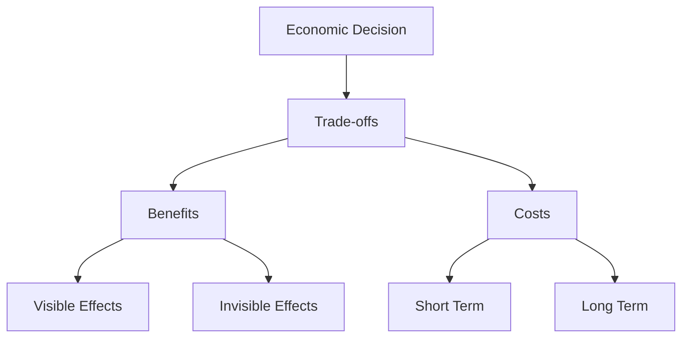

# Basic Economics

    "Economics is the study of the use of scarce resources which have alternative uses."
    

        — Basic Economics (2000)
    

## Core Concept

Economics isn't about money - it's about making choices under constraints. Every decision we make involves trade-offs, because:
- Resources are limited
- Wants are unlimited
- Every resource has alternative uses

## Three Fundamental Questions

Every economic system must answer:
1. What to produce?
2. How to produce it?
3. Who gets what is produced?

## Key Principles

### 1. Incentives Matter

    "No one will ever work as hard for your interests as they will work for their own."
    

        — Knowledge and Decisions (1980)
    

People respond to incentives. When prices rise, people buy less. When wages rise, more people seek those jobs. This isn't about greed - it's about human nature.

### 2. There Are No Solutions, Only Trade-offs

    "There are no solutions. There are only trade-offs."
    

        — A Conflict of Visions (1987)
    

Every decision has:
- Benefits and costs
- Winners and losers
- Intended and unintended consequences

### 3. Prices Convey Information

    "Prices are important not because money is considered paramount but because prices are a fast and effective conveyor of information through a vast society in which fragmented knowledge must be coordinated."
    

        — Knowledge and Decisions (1980)
    

## Real-World Application

Let's take a simple example: The Price of Coffee

When coffee crops fail in Brazil:
1. Prices rise
2. Consumers buy less coffee
3. Some switch to tea
4. Farmers elsewhere plant more coffee
5. Resources shift automatically

No central planner needed to:
- Tell people to conserve coffee
- Direct farmers what to plant
- Decide who gets how much

## Think It Through

Consider this scenario:
> Your city bans "price gouging" during a natural disaster, keeping water prices at normal levels. What are the:
- Intended consequences?
- Unintended consequences?
- Trade-offs involved?

## Visual Summary

## Key Takeaways

1. Economics is about trade-offs, not money
2. Incentives drive human behavior
3. Prices communicate information
4. Good intentions ≠ Good results
5. Consider both seen and unseen effects

## Further Reading
- Basic Economics (2000)
- Applied Economics (2003)
- Economic Facts and Fallacies (2008)
