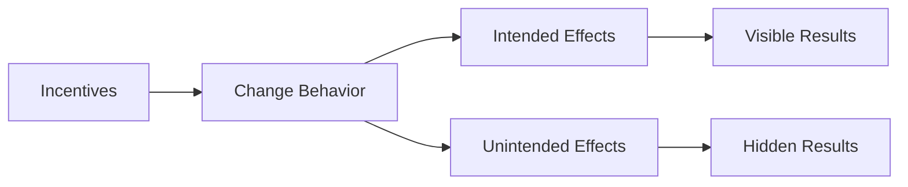

# Incentives and Trade-offs

    "The most basic question is not what is best, but who shall decide what is best."
    

        — Knowledge and Decisions (1980)
    

## Why Incentives Matter

Incentives are the invisible force that drives human behavior. They explain:
- Why people work harder for themselves than for others.
- How prices affect behavior.
- Why good intentions often lead to unintended results.

## Types of Incentives

1. **Economic Incentives**
   - **Prices:** Influence consumer choices and producer supply.
   - **Wages:** Affect labor supply and effort.
   - **Profits/Losses:** Drive business decisions and innovation.

2. **Social Incentives**
   - **Recognition:** Motivates individuals through praise and acknowledgment.
   - **Status:** Drives behavior to achieve higher social standing.
   - **Reputation:** Encourages actions that maintain or enhance one's image.

3. **Moral Incentives**
   - **Personal Values:** Guide decisions based on individual beliefs.
   - **Cultural Norms:** Influence behavior through societal expectations.
   - **Religious Beliefs:** Shape actions according to spiritual principles.

## Real-World Example: The Taxi Market

### Traditional Taxis
- **Fixed Prices:** Little flexibility in response to demand changes.
- **Limited Supply:** Often results in long wait times.
- **Service Quality:** Can be inconsistent due to lack of competition.

### Ride-sharing (Uber/Lyft)
- **Dynamic Pricing:** Adjusts based on demand, incentivizing more drivers.
- **Flexible Supply:** Drivers can enter or leave the market easily.
- **Quick Response:** Shorter wait times and improved service quality.

**The difference? Incentives.**

## Think It Through

Consider minimum wage laws:
1. **What are they intended to do?**
   - Increase earnings for low-wage workers.
2. **How do they change incentives for:**
   - **Employers?** May reduce hiring or automate jobs.
   - **Workers?** Can increase job competition and effort.
   - **Consumers?** Potentially face higher prices for goods and services.
3. **What are the unintended consequences?**
   - Possible job losses or reduced hours for low-skilled workers.

## Visual Summary

## Key Points

1. People respond to incentives, not wishes.
2. Good intentions don't guarantee good results.
3. Consider all incentives, not just monetary ones.
4. Look for unintended consequences.

Understanding incentives is crucial for predicting behavior and crafting effective policies. Always consider the broader impact of any incentive structure.