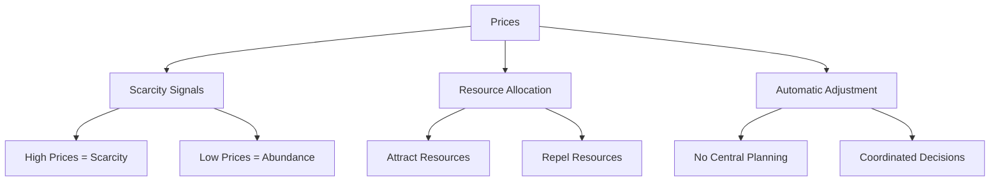

# Prices and Information

  "Prices are important not because money is considered paramount but because prices are a fast and effective conveyor of information through a vast society in which fragmented knowledge must be coordinated."
  

      — Knowledge and Decisions (1980)
  

## Core Concept

Prices are not just numbers—they are messages that coordinate millions of decisions across society. They tell us:
- What is scarce
- What is abundant
- Where resources are needed
- What should be produced

## How Prices Communicate

### 1. Scarcity Signals
- **High Prices = Scarcity:**
  - Indicate limited supply or high demand.
  - Encourage conservation and increased production.
- **Low Prices = Abundance:**
  - Suggest plentiful supply or low demand.
  - Encourage consumption and reduced production.

### 2. Resource Allocation
- **Higher Prices Attract Resources:**
  - Direct resources to where they are most needed.
  - Encourage investment and innovation in high-demand areas.
- **Lower Prices Repel Resources:**
  - Signal to reduce production or shift focus.

### 3. Automatic Adjustment
- **No Central Planning Needed:**
  - Prices naturally adjust based on supply and demand.
  - Millions of individual decisions are coordinated without centralized control.

## Real-World Example: Gas Prices

When gas prices rise:
1. People drive less to save money.
2. Consumers buy more fuel-efficient cars.
3. Increased use of public transportation.
4. People choose to live closer to work.
5. Companies invest in alternative energy sources.

No government intervention is needed to prompt these changes; the price signal alone is sufficient.

## Visual Summary

## Key Takeaways

1. Prices convey critical information about scarcity and abundance.
2. They guide resource allocation efficiently without central planning.
3. Price changes lead to automatic adjustments in behavior and production.
4. Understanding price signals is essential for making informed economic decisions.

For further exploration of how prices impact different sectors, see the [Real-World Applications](../real-world.md) section.