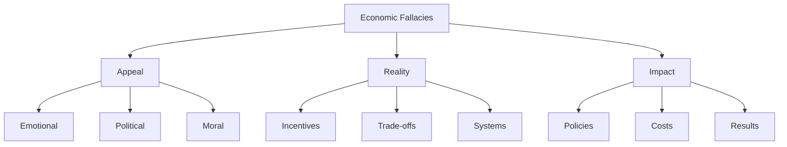

# Economic Facts and Fallacies

  "Much of the social history of the Western world, over the past three decades, has been a history of replacing what worked with what sounded good."
  

      — The Vision of the Anointed (1995)
  

"The first lesson of economics is scarcity. The first lesson of politics is to ignore the first lesson of economics."

— Economic Facts and Fallacies (2008)

## Understanding Economic Fallacies

### What Is a Fallacy?
- Logical but wrong
- Seemingly obvious
- Emotionally appealing
- Politically useful

### Why Fallacies Persist
- Feel-good solutions
- Hidden costs
- Concentrated benefits
- Dispersed costs

## Common Economic Fallacies

### 1. The Zero-Sum Fallacy
- Wealth must be taken
- Fixed pie thinking
- Trade hurts someone
- Success causes poverty

### 2. The Free Lunch Fallacy
- Government can provide
- Someone else pays
- No trade-offs exist
- Costs can be hidden

### 3. The Composition Fallacy
- What's true for one is true for all
- Ignoring system effects
- Missing connections
- Overlooking adaptation

## Facts vs. Feelings

"Facts are not liberals' strong suit. Rhetoric is."

— Ever Wonder Why? (2006)

### Emotional Appeal
- Good intentions
- Visible benefits
- Dramatic stories
- Moral claims

### Economic Reality
- Incentives matter
- Trade-offs exist
- Margins drive change
- Systems adapt

## Visual Summary

## Common Policy Mistakes

### Price Controls
- Ignore supply and demand
- Create shortages
- Reduce quality
- Drive black markets

### Labor Laws
- Hurt intended beneficiaries
- Reduce opportunities
- Increase costs
- Create unemployment

### Trade Restrictions
- Protect few jobs
- Harm many consumers
- Reduce efficiency
- Lower living standards

## Think Like an Economist

"Competition does a much more effective job than government at protecting consumers."

— Economic Facts and Fallacies (2008)

### Key Questions
1. What are the incentives?
2. Who pays the costs?
3. What gets ignored?
4. How do people adapt?

### Analysis Tools
- Look for trade-offs
- Check incentives
- Consider margins
- Follow results

## Real-World Applications

### Housing Markets
- Rent control effects
- Zoning impacts
- Development costs
- Market responses

### Labor Markets
- Minimum wage
- Work regulations
- Union effects
- Employment patterns

### International Trade
- Tariff impacts
- Competition benefits
- Specialization gains
- Adaptation patterns

## Practical Guidelines

### For Citizens
- Question obvious solutions
- Look for hidden costs
- Consider incentives
- Follow results

### For Policymakers
- Study history
- Consider trade-offs
- Watch incentives
- Measure outcomes

### For Analysis
- Check assumptions
- Follow evidence
- Consider time
- Study systems

## Key Takeaways

1. Question the obvious
2. Look for hidden costs
3. Study incentives
4. Follow evidence
5. Consider time

"The most basic question is not what is best, but who shall decide what is best."

— Applied Economics (2009)

