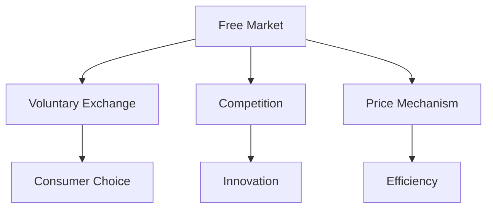

# The Free Market

"The most basic question is not what is best, but who shall decide what is best."

— Applied Economics (2009)

## Understanding the Free Market

### Definition
- An economic system where prices are determined by unrestricted competition between privately owned businesses.
- Decisions regarding investment, production, and distribution are based on supply and demand.
- Minimal government intervention.

### Key Characteristics
- Voluntary exchange: Transactions are made freely and willingly by all parties.
- Competition: Drives innovation, efficiency, and quality.
- Price mechanism: Prices reflect the relative scarcity and value of goods and services.

## Benefits of the Free Market

### Efficiency
- Resources are allocated to their most valued uses.
- Producers and consumers respond to price signals.
- Competition encourages cost-cutting and innovation.

### Innovation
- Incentives for entrepreneurs to develop new products and services.
- Risk-taking is rewarded with potential profits.
- Technological advancements improve living standards.

### Consumer Choice
- Wide variety of goods and services available.
- Consumers have the power to influence the market through their purchasing decisions.
- Businesses must cater to consumer preferences to succeed.

## Common Misconceptions

### Monopoly Power
- Misconception: Free markets lead to monopolies.
- Reality: While monopolies can form, competition and innovation often challenge them.

### Inequality
- Misconception: Free markets inherently create inequality.
- Reality: While disparities exist, free markets can also provide opportunities for upward mobility.

### Regulation Necessity
- Misconception: Markets need heavy regulation to function.
- Reality: Some regulation is necessary, but excessive control can stifle innovation and efficiency.

## Visual Summary

## Real-World Applications

### Technology Sector
- Rapid innovation and competition drive progress.
- Companies like Apple and Google thrive in a competitive environment.

### Retail Industry
- Consumer preferences shape product offerings.
- Companies like Amazon succeed by responding to market demands.

### Global Trade
- Countries specialize based on comparative advantage.
- Trade agreements facilitate market access and economic growth.

## Challenges and Considerations

### Market Failures
- Externalities: Costs or benefits not reflected in market prices.
- Public goods: Non-excludable and non-rivalrous goods that markets may underprovide.

### Role of Government
- Protect property rights and enforce contracts.
- Provide a legal framework for market operations.
- Address market failures where necessary.

## Key Takeaways

1. Free markets rely on voluntary exchange and competition.
2. They drive efficiency, innovation, and consumer choice.
3. Misconceptions about free markets often lead to calls for unnecessary regulation.
4. Understanding the dynamics of free markets helps in crafting effective economic policies.

"Competition does a much more effective job than government at protecting consumers."

— Economic Facts and Fallacies (2008)

