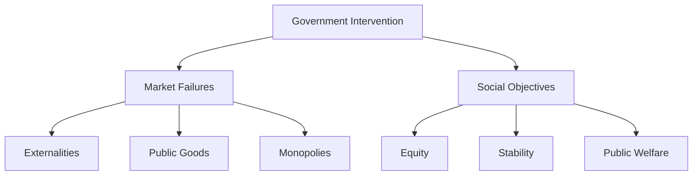

# Government Intervention

"The government solution to a problem is usually as bad as the problem."

— Milton Friedman

## Understanding Government Intervention

### Definition
- Actions taken by a government to influence its economy.
- Includes regulations, taxes, subsidies, and direct control over certain sectors.
- Aimed at correcting market failures, redistributing resources, or achieving social goals.

### Types of Intervention
- **Regulatory**: Setting rules for businesses and consumers.
- **Fiscal**: Using government spending and taxation to influence the economy.
- **Monetary**: Controlling the money supply and interest rates.
- **Direct Control**: Government ownership or control of resources and industries.

## Reasons for Government Intervention

### Market Failures
- **Externalities**: Costs or benefits not reflected in market prices (e.g., pollution).
- **Public Goods**: Goods that are non-excludable and non-rivalrous (e.g., national defense).
- **Monopolies**: Single firms dominating a market, reducing competition.

### Social Objectives
- **Equity**: Redistribution of wealth to reduce inequality.
- **Stability**: Managing economic cycles to prevent recessions and inflation.
- **Public Welfare**: Ensuring access to essential services like healthcare and education.

## Benefits and Drawbacks

### Potential Benefits
- Corrects market failures and improves resource allocation.
- Provides public goods and services that markets may underprovide.
- Stabilizes the economy during downturns.

### Potential Drawbacks
- **Inefficiency**: Government actions can lead to resource misallocation.
- **Bureaucracy**: Slows down decision-making and innovation.
- **Unintended Consequences**: Policies may have adverse effects not anticipated.

## Examples of Government Intervention

### Minimum Wage Laws
- Aim: Ensure a living wage for workers.
- Drawback: Can lead to unemployment if set above the market rate.

### Environmental Regulations
- Aim: Reduce pollution and protect natural resources.
- Drawback: Can increase costs for businesses and consumers.

### Agricultural Subsidies
- Aim: Support farmers and stabilize food prices.
- Drawback: Can distort market prices and lead to overproduction.

## Visual Summary

## Balancing Intervention and Market Freedom

### Key Considerations
- **Proportionality**: Ensure interventions are proportionate to the problem.
- **Efficiency**: Minimize bureaucratic overhead and focus on outcomes.
- **Flexibility**: Adapt policies to changing economic conditions.

### Role of Policymakers
- Evaluate the necessity and impact of interventions.
- Balance short-term benefits with long-term consequences.
- Foster an environment where markets can function effectively.

## Key Takeaways

1. Government intervention aims to correct market failures and achieve social goals.
2. While beneficial in some cases, it can lead to inefficiencies and unintended consequences.
3. Effective policy requires balancing intervention with market freedom.
4. Understanding the role and impact of government actions is crucial for informed decision-making.

"The most basic question is not what is best, but who shall decide what is best."

— Applied Economics (2009)

