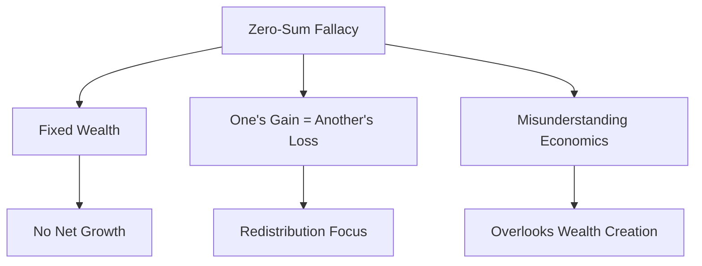

# The Zero-Sum Fallacy

  "What is called 'redistribution' of wealth or income implies that there is some prior distribution that is either right or wrong."
  

      — Economic Facts and Fallacies (2008)
  

## Understanding the Zero-Sum Fallacy

### Definition
- The belief that one person's gain is inherently another's loss.
- Assumes a fixed amount of wealth or resources.
- Commonly applied to economics, politics, and social issues.

### Why It Persists
- Intuitive simplicity: Easy to understand and emotionally appealing.
- Political utility: Used to justify redistribution policies.
- Misunderstanding of economic principles: Overlooks the potential for wealth creation.

## The Reality of Wealth Creation

### Economic Growth
- Wealth is not a fixed pie; it can expand through innovation and productivity.
- Economic activities like trade and investment create new value.
- Historical evidence shows that economies grow over time, increasing overall wealth.

### Positive-Sum Interactions
- Voluntary exchange benefits all parties involved, creating additional value.
- Specialization and trade allow for more efficient production and consumption.
- Comparative advantage enables countries and individuals to benefit from their strengths.

## Examples of Zero-Sum Thinking

### Trade and Globalization
- Misconception: Imports harm domestic industries by taking away jobs.
- Reality: Trade allows access to cheaper goods, increases efficiency, and creates new jobs in other sectors.

### Wealth and Income Inequality
- Misconception: The rich get richer at the expense of the poor.
- Reality: Economic growth can lift all income levels, though distribution may vary.

### Immigration
- Misconception: Immigrants take jobs from native workers.
- Reality: Immigrants often fill labor shortages and contribute to economic growth.

## Visual Summary

## Overcoming the Fallacy

### Education and Awareness
- Promote understanding of economic principles.
- Highlight examples of positive-sum outcomes.
- Encourage critical thinking about economic policies.

### Policy Implications
- Focus on policies that encourage growth and innovation.
- Avoid protectionist measures that assume zero-sum outcomes.
- Support education and training to adapt to economic changes.

## Key Takeaways

1. Wealth is not fixed; it can grow through innovation and trade.
2. Positive-sum interactions benefit all parties involved.
3. Zero-sum thinking can lead to misguided policies.
4. Understanding economic principles helps overcome this fallacy.

"The most basic question is not what is best, but who shall decide what is best."

— Applied Economics (2009)

