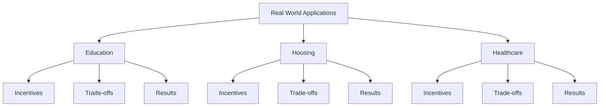

# Real World Applications

  "The first lesson of economics is scarcity: there is never enough of anything to fully satisfy all those who want it. The first lesson of politics is to disregard the first lesson of economics."
  

      — Basic Economics (2000)
  

## Why Real World Applications Matter

Thomas Sowell's genius lies in his ability to take complex economic principles and show how they affect everyday life. This section demonstrates how economic principles explain real-world outcomes in:
- Education
- Housing
- Healthcare

## Key Principles in Action

### 1. Incentives Matter
Every policy creates incentives that affect behavior:
- Price controls → Shortages
- Subsidies → Increased costs
- Regulations → Unintended consequences

### 2. There Are No Solutions, Only Trade-offs
Every policy decision involves trade-offs:
- Higher quality vs. Lower costs
- Access vs. Excellence
- Present benefits vs. Future costs

### 3. Stage One vs. Stage Two Thinking
We must consider:
- Immediate effects
- Long-term consequences
- Indirect effects
- Unintended results

## Common Patterns in Real World Issues

### Pattern 1: Good Intentions vs. Results

  "Much of the social history of the Western world over the past three decades has been a history of replacing what worked with what sounded good."
  

      — Is Reality Optional? (1993)
  

Examples:
- Rent control reducing housing supply
- Minimum wage increasing unemployment
- Free college reducing educational quality

### Pattern 2: The Political Factor

  "Politics is the art of making your selfish desires seem like the national interest."
  

      — Ever Wonder Why? (2006)
  

Common political patterns:
1. Crisis declaration
2. Government solution proposed
3. Critics dismissed
4. Failure blamed on insufficient funding
5. Repeat

### Pattern 3: The Role of Prices
In each sector we examine:
- What happens when prices are controlled
- How prices coordinate resources
- Why price signals matter

## How to Use This Section

Each subsequent chapter examines a specific sector:

1. **Education**
 - Government vs. Private schools
 - College financing
 - Educational standards

2. **Housing**
 - Rent control effects
 - Zoning laws
 - Affordable housing policies

3. **Healthcare**
 - Insurance systems
 - Price transparency
 - Quality of care

## Think It Through

Before reading each chapter, consider:
1. What are the incentives for each participant?
2. Who bears the costs?
3. Who makes the decisions?
4. What are the trade-offs?

## Visual Summary
