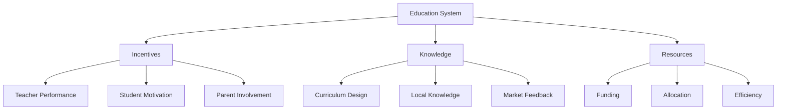

# Education

"The most fundamental fact about the ideas of the political left is that they do not work. Therefore we should not be surprised to find the left concentrated in institutions where ideas do not have to work in order to survive."

— Inside American Education (1993)

## Core Issues in Education

### 1. The Knowledge Problem
- Who knows best what students need?
- How should curriculum be determined?
- Can central planners effectively design education?

### 2. Incentive Structures
- Public vs. Private schools
- Teacher performance metrics
- Student motivation
- Parent involvement

### 3. Resource Allocation
- School funding
- Teacher salaries
- Facilities investment
- Technology integration

## Common Misconceptions

"Much of what is called 'education' is not education at all but credential-collecting."

— Inside American Education (1993)

### Myth 1: More Spending = Better Education
- US spending per student has tripled in real terms since 1970
- Test scores remain flat
- Private schools often achieve better results with less funding

### Myth 2: Education Requires Uniformity
- Different students have different needs
- One-size-fits-all approaches fail many
- Competition improves quality

### Myth 3: Only Experts Can Judge Education
- Parents often know their children's needs best
- Market feedback provides valuable information
- Local knowledge matters

## Real-World Evidence

### Case Study: School Choice
- Competition improves performance
- Parents make informed choices
- Resources follow student needs

### Charter Schools
- Innovation in teaching methods
- Accountability to results
- Freedom to adapt

### Private Schools
- Lower costs
- Better outcomes
- Market discipline

## Solutions and Trade-offs

### 1. School Choice
Benefits:
- Competition
- Innovation
- Customization

Challenges:
- Transportation
- Information access
- Transition costs

### 2. Teacher Accountability
Benefits:
- Merit-based advancement
- Performance incentives
- Quality improvement

Challenges:
- Measurement difficulties
- Gaming the system
- Resistance to change

### 3. Funding Reform
Benefits:
- Resource efficiency
- Local control
- Direct accountability

Challenges:
- Income disparities
- Implementation complexity
- Political resistance

## Think It Through

Questions to consider:
1. Who should decide what children learn?
2. How can we measure educational success?
3. What role should government play?
4. How do we balance equality and excellence?

## Visual Summary

## Key Takeaways

1. Education improves through choice and competition
2. Local knowledge often outperforms central planning
3. Incentives matter more than intentions
4. Results matter more than spending
5. There are no perfect solutions, only trade-offs

"If you have always believed that everyone should play by the same rules and be judged by the same standards, that would have gotten you labeled a radical 60 years ago, a liberal 30 years ago and a racist today."

— Ever Wonder Why? (2006)

