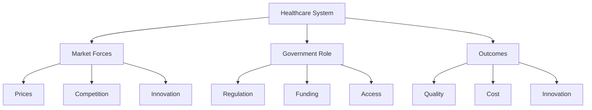

# Healthcare

"It is amazing that people who think we cannot afford to pay for doctors, hospitals, and medication somehow think that we can afford to pay for doctors, hospitals, medication and a government bureaucracy to administer it."

— Knowledge and Decisions (1980)

## Core Healthcare Economics

### 1. Fundamental Issues
- Scarcity of resources
- Unlimited wants
- Quality vs. access
- Innovation vs. cost

### 2. Market Distortions
- Third-party payment
- Hidden prices
- Regulatory burden
- Limited competition

## Common Healthcare Myths

"The problem isn't that our system isn't working the way it should. The problem is that it's working exactly the way it must."

— Applied Economics (2009)

### Myth 1: Healthcare Is Different
- Basic economics still applies
- Incentives matter
- Prices coordinate information
- Competition improves quality

### Myth 2: More Government = Better Care
- Administrative costs increase
- Innovation decreases
- Quality often suffers
- Waiting times extend

### Myth 3: Universal Coverage = Universal Care
- Access ≠ Quality
- Coverage ≠ Care
- Promises ≠ Delivery
- Intentions ≠ Results

## Real-World Evidence

### Case Study: Price Transparency
Effects when prices are visible:
- Lower costs
- Better choices
- Quality competition
- Innovation

### Case Study: Direct Primary Care
Benefits:
- Lower costs
- Better access
- Higher satisfaction
- Simplified care

## Market Solutions vs. Government Control

### Market Approaches
Benefits:
- Price discovery
- Innovation
- Quality improvement
- Consumer choice

Challenges:
- Transition difficulties
- Information asymmetry
- Emergency care
- Chronic conditions

### Government Control
Benefits:
- Universal coverage
- Standardization
- Pooled risk
- Simplified billing

Challenges:
- Rationing
- Waiting lists
- Reduced innovation
- Higher costs

## The Role of Prices

### When Prices Work
- Elective procedures
- Routine care
- Chronic management
- Preventive services

### Price Challenges
- Emergency care
- Rare conditions
- Complex procedures
- Research development

## Visual Summary

## Solutions and Trade-offs

### 1. Price Transparency
Benefits:
- Informed decisions
- Cost competition
- Quality metrics
- Market efficiency

### 2. Direct Payment
Benefits:
- Lower overhead
- Better service
- Price sensitivity
- Quality focus

### 3. Insurance Reform
Benefits:
- Consumer choice
- Risk management
- Market competition
- Innovation incentives

## Think It Through

Questions to consider:
1. Who should pay for healthcare?
2. How do we balance access and quality?
3. What role should government play?
4. How do we encourage innovation?

## Key Takeaways

"There are no solutions. There are only trade-offs."

— A Conflict of Visions (1987)

1. Markets coordinate healthcare better than bureaucracies
2. Prices matter for efficiency and innovation
3. Third-party payment distorts incentives
4. Competition improves quality and reduces costs
5. Good intentions don't guarantee good results

## Practical Applications

### For Patients
- Seek price information
- Consider direct payment
- Compare options
- Focus on prevention

### For Providers
- Transparent pricing
- Quality metrics
- Direct relationships
- Innovation focus

### For Policymakers
- Remove barriers
- Enable competition
- Protect innovation
- Focus on results
