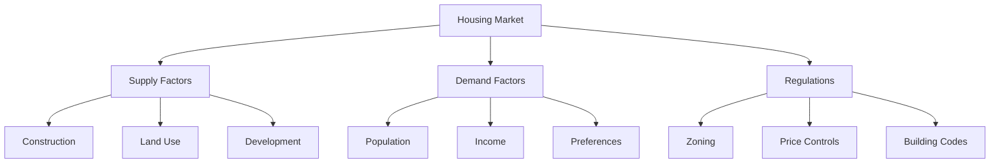

# Housing

"The first lesson of economics is scarcity: there is never enough of anything to fully satisfy all those who want it. The first lesson of politics is to disregard the first lesson of economics."

— Basic Economics (2000)

## The Housing Market Fundamentals

### 1. Supply and Demand
- Housing prices reflect local conditions
- Artificial constraints create shortages
- Natural constraints affect pricing
- Market signals guide development

### 2. Price Mechanisms
- Prices coordinate information
- Reflect relative scarcity
- Guide resource allocation
- Signal consumer preferences

## Common Housing Policies and Their Effects

"The assumption that spending more of the taxpayer's money will make things better has survived all kinds of evidence that it has made things worse."

— The Vision of the Anointed (1995)

### 1. Rent Control
Effects:
- Reduced housing supply
- Deteriorating quality
- Black markets
- Misallocation of resources

### 2. Zoning Laws
Consequences:
- Artificial scarcity
- Higher housing costs
- Reduced mobility
- Economic segregation

### 3. "Affordable Housing" Mandates
Results:
- Higher overall prices
- Reduced construction
- Cross-subsidization
- Market distortions

## Real-World Evidence

### Case Study: San Francisco
- Strict rent control
- Restrictive zoning
- Highest housing costs
- Reduced new construction

### Case Study: Houston
- Minimal zoning
- Market-driven development
- Lower housing costs
- Faster growth

## The Role of Government

### Harmful Interventions
1. Price controls
2. Excessive regulation
3. Restrictive zoning
4. Development limits

### Useful Functions
1. Property rights protection
2. Contract enforcement
3. Infrastructure provision
4. Safety standards

## Solutions and Trade-offs

### Market-Based Approaches
Benefits:
- Efficient allocation
- Price discovery
- Innovation
- Responsiveness

Challenges:
- Transition costs
- Political resistance
- NIMBY opposition

### Regulatory Reform
Benefits:
- Increased supply
- Lower costs
- More choices
- Better matching

Challenges:
- Local opposition
- Implementation
- Coordination

## Visual Summary

## Key Principles

"Much of the social history of the Western world over the past three decades has been a history of replacing what worked with what sounded good."

— Is Reality Optional? (1993)

### 1. Market Forces
- Prices coordinate information
- Supply responds to demand
- Competition improves quality
- Innovation reduces costs

### 2. Government Impact
- Regulations affect supply
- Controls distort markets
- Incentives matter
- Unintended consequences

### 3. Trade-offs
- Affordability vs. quality
- Density vs. space
- Growth vs. preservation
- Current vs. future needs

## Think It Through

Questions to consider:
1. Who benefits from housing regulations?
2. What are the hidden costs of intervention?
3. How do we balance competing interests?
4. What role should local government play?

## Key Takeaways

1. Markets coordinate housing better than planners
2. Regulations often cause the problems they aim to solve
3. Local knowledge matters more than central planning
4. There are no solutions, only trade-offs
5. Good intentions don't guarantee good results

"The real minimum wage is zero - unemployment."

— Basic Economics (2000)

