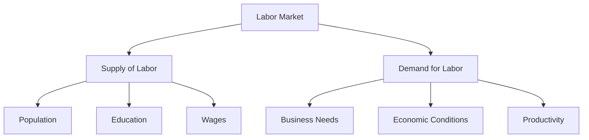

# Labor Markets

"People who enjoy meetings should not be in charge of anything."

— Thomas Sowell

## Understanding Labor Markets

### Core Concept
- Labor markets are where workers offer their skills and employers seek to hire them.
- Wages are determined by the supply of and demand for labor.

### Key Dynamics
1. **Supply of Labor:**
   - Influenced by population size, education levels, and cultural factors.
   - Higher wages typically increase the supply of labor as more individuals are willing to work.

2. **Demand for Labor:**
   - Driven by the needs of businesses and economic conditions.
   - Higher productivity and profitability increase demand for labor.

## Real-World Applications

### Minimum Wage Laws
- **Impact on Supply:**
  - Higher minimum wages can attract more workers into the labor force.
- **Impact on Demand:**
  - Employers may reduce hiring or cut hours to manage increased labor costs.
- **Who Benefits?**
  - Workers who retain their jobs at higher wages.
- **Who Loses?**
  - Potential job seekers and low-skilled workers who may face reduced opportunities.

### Skills and Education
- **Skills Mismatch:**
  - When workers' skills do not match job requirements, unemployment can rise.
- **Education and Training:**
  - Investment in education can increase the supply of skilled labor, meeting industry demands.

### Technological Change
- **Automation:**
  - Can reduce demand for certain types of labor while increasing demand for tech-savvy workers.
- **Adaptation:**
  - Workers may need to acquire new skills to remain competitive.

## Visual Summary

## Policy Considerations

### Balancing Act
- **Regulation vs. Flexibility:**
  - Policies should balance protecting workers with allowing market flexibility.
- **Education and Training:**
  - Governments and businesses can collaborate to provide relevant training programs.

### Economic Indicators
- **Unemployment Rate:**
  - A key measure of labor market health.
- **Labor Force Participation Rate:**
  - Indicates the percentage of the working-age population that is employed or actively seeking work.

## Key Takeaways

1. Labor markets are dynamic and influenced by various economic factors.
2. Wages are determined by the interaction of labor supply and demand.
3. Policies affecting labor markets must consider both short-term impacts and long-term growth.
4. Continuous learning and adaptation are crucial for workers in a changing economy.

For more insights on how labor markets interact with broader economic principles, refer to the [Supply and Demand](supply-demand.md) chapter.