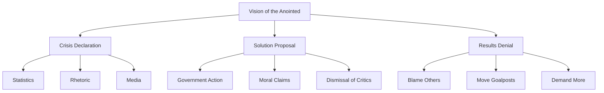

# The Vision of the Anointed

"The vision of the anointed is one in which ills of society can be solved by the wisdom and will of its elites, and progress is measured by how much power is shifted to those elites."

— The Vision of the Anointed (1995)

## Core Concept

The Vision of the Anointed describes how intellectual elites:
- See themselves as morally and intellectually superior
- Believe they can solve society's problems through control
- Dismiss opposing views as stemming from ignorance or bad motives
- Judge policies by intentions rather than results

## The Pattern

### Stage 1: "The Crisis"
- Declare a crisis exists
- Use dramatic language
- Cherry-pick statistics
- Ignore contrary evidence

### Stage 2: "The Solution"
- Propose government intervention
- Claim moral high ground
- Dismiss cost concerns
- Promise dramatic results

### Stage 3: "The Results"
- Ignore actual outcomes
- Blame insufficient funding
- Attack critics' motives
- Move goalposts

### Stage 4: "The Response"
- Deny failure
- Claim more time needed
- Propose bigger programs
- Repeat cycle

## Real-World Examples

"It is hard to imagine a more stupid or dangerous way of making decisions than by putting those decisions in the hands of people who pay no price for being wrong."

— Basic Economics (2000)

### War on Poverty
- Crisis declared
- Massive programs launched
- Poverty rate stopped falling
- Spending increased anyway

### Education Reform
- Crisis declared
- Spending tripled
- Results flat or worse
- More spending demanded

### Housing Policy
- Crisis declared
- Controls imposed
- Shortages created
- More controls proposed

## Key Characteristics

### 1. Moral Superiority
- Self-congratulation
- Dismissal of critics
- Assumption of bad faith
- Moral preening

### 2. Causation vs. Correlation
- Confusing correlation with causation
- Ignoring alternative explanations
- Dismissing contradictory evidence
- Selective use of statistics

### 3. Trade-offs vs. Solutions
- Ignoring trade-offs
- Promising solutions
- Dismissing constraints
- Avoiding accountability

## Visual Summary

## How to Recognize It

### Red Flags
1. Crisis language
2. Moral superiority
3. Dismissal of trade-offs
4. Attack on critics' motives
5. Immunity to evidence

### Common Phrases
- "We must act now"
- "Only the government can"
- "For the children"
- "Social justice demands"
- "Critics don't care about..."

## Think It Through

"The most basic question is not what is best, but who shall decide what is best."

— Knowledge and Decisions (1980)

Questions to consider:
1. Who pays the costs?
2. What are the incentives?
3. What is the evidence?
4. What are the trade-offs?

## Key Takeaways

1. Judge policies by results, not intentions
2. Consider incentives and trade-offs
3. Demand evidence, not rhetoric
4. Watch for the pattern
5. Follow the money

