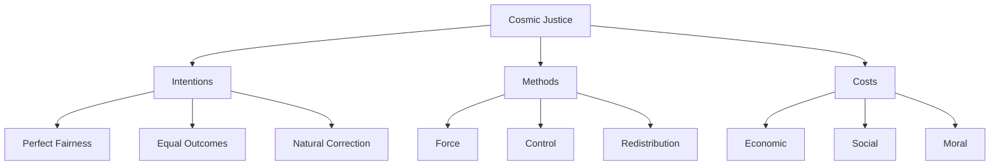

# The Quest for Cosmic Justice

"There are no solutions. There are only trade-offs."

— The Quest for Cosmic Justice (1999)

## Understanding Cosmic Justice

### Definition
- Attempting to correct all inequalities
- Seeking perfect fairness
- Correcting nature's "unfairness"
- Equalizing starting points

### The Problem
- Impossible to achieve
- Requires unlimited power
- Ignores human nature
- Creates new injustices

## Traditional vs. Cosmic Justice

"Life has never been even approximately fair, so the question is whether we should destroy what works to create an impossible fairness."

— The Quest for Cosmic Justice (1999)

### Traditional Justice
- Rules apply equally
- Process-focused
- Limited scope
- Achievable goals

### Cosmic Justice
- Outcome-focused
- Unlimited scope
- Requires force
- Impossible goals

## The Cost of Cosmic Justice

### Economic Costs
- Reduced efficiency
- Lower productivity
- Wasted resources
- Missed opportunities

### Social Costs
- Increased conflict
- Reduced freedom
- Lost trust
- Divided society

### Moral Costs
- Arbitrary power
- Forced outcomes
- Lost rights
- Diminished responsibility

## Visual Summary

## Common Fallacies

"When you want to help people, you tell them the truth. When you want to help yourself, you tell them what they want to hear."

— Ever Wonder Why? (2006)

### 1. The Perfect World Fallacy
- Comparing reality to perfection
- Ignoring trade-offs
- Demanding impossible standards
- Rejecting incremental improvement

### 2. The Power Fallacy
- Assuming perfect knowledge
- Ignoring corruption
- Trusting authority
- Dismissing human nature

### 3. The Intention Fallacy
- Judging by motives
- Ignoring results
- Dismissing costs
- Avoiding responsibility

## Real-World Applications

### Education
- Equal outcomes vs. opportunity
- Standards vs. "fairness"
- Merit vs. representation
- Excellence vs. equity

### Economics
- Income equality
- Wealth redistribution
- Price controls
- Market intervention

### Social Policy
- Affirmative action
- Housing policy
- Healthcare access
- Social programs

## Think It Through

"There are no perfect solutions in an imperfect world."

— The Quest for Cosmic Justice (1999)

Questions to consider:
1. What are the costs?
2. Who pays them?
3. What are the trade-offs?
4. Is it achievable?

## Key Principles

### 1. Accept Imperfection
- Life isn't fair
- Perfect equality impossible
- Trade-offs exist
- Incremental improvement matters

### 2. Focus on Process
- Equal rules
- Clear standards
- Fair procedures
- Limited goals

### 3. Consider Consequences
- Actual results
- Hidden costs
- Long-term effects
- Unintended outcomes

## Practical Applications

### For Citizens
- Accept reality
- Seek improvement
- Consider costs
- Value freedom

### For Leaders
- Focus on achievable goals
- Respect limits
- Consider trade-offs
- Value process

### For Society
- Protect freedom
- Accept differences
- Value merit
- Respect rights

## Key Takeaways

1. Perfect fairness is impossible
2. Attempts at cosmic justice create new injustices
3. Process matters more than outcomes
4. Trade-offs are inevitable
5. Freedom requires accepting differences

"The first lesson of economics is scarcity: There is never enough of anything to satisfy all those who want it. The first lesson of politics is to disregard the first lesson of economics."

— Basic Economics (2000)

