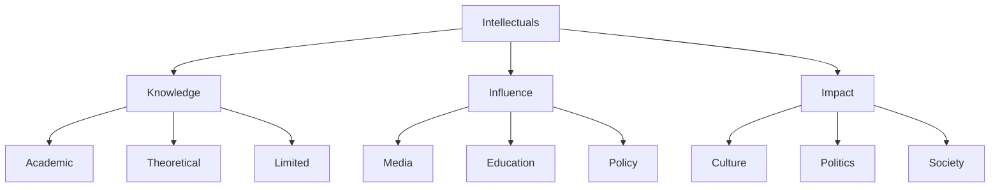

# Intellectuals and Society

"Intellect is not wisdom. Intellectuals have often been spectacularly wrong in their moral and social visions, as well as in their more concrete predictions."

— Intellectuals and Society (2009)

## Understanding Intellectuals

### Definition
- People whose product is ideas
- Work with words and symbols
- Judge themselves by intentions
- Evaluated by peer consensus

### Characteristics
- Broad pronouncements
- Limited accountability
- Moral self-congratulation
- Disdain for practical knowledge

## The Knowledge Problem

"The most fundamental fact about the ideas of the political left is that they do not work. Therefore we should not be surprised to find the left concentrated in institutions where ideas do not have to work in order to survive."

— Intellectuals and Society (2009)

### Types of Knowledge
1. Academic Knowledge
   - Theoretical
   - Systematic
   - Explicit
   - Taught

2. Practical Knowledge
   - Experience-based
   - Contextual
   - Implicit
   - Learned

## The Intellectual's Impact

### Areas of Influence
- Education
- Media
- Government
- Culture

### Methods of Influence
- Frame debates
- Define problems
- Propose solutions
- Shape narratives

## Common Intellectual Fallacies

### 1. The Special Knowledge Fallacy
- Assuming expertise transfers
- Ignoring local knowledge
- Dismissing practical experience
- Overvaluing theory

### 2. The Moral Fallacy
- Judging by intentions
- Ignoring results
- Claiming moral high ground
- Dismissing trade-offs

### 3. The Central Planning Fallacy
- Assuming superior knowledge
- Ignoring complexity
- Dismissing spontaneous order
- Overvaluing control

## Visual Summary

## Real-World Examples

"It takes considerable knowledge just to realize the extent of your own ignorance."

— Knowledge and Decisions (1980)

### Economic Planning
- Price controls
- Central planning
- Market intervention
- Social engineering

### Social Policy
- Housing policies
- Education reform
- Poverty programs
- Healthcare systems

## The Role of Incentives

### For Intellectuals
- Peer approval
- Status
- Influence
- Recognition

### For Society
- Results matter
- Trade-offs exist
- Knowledge is dispersed
- Incentives drive behavior

## Think It Through

Questions to consider:
1. Who has skin in the game?
2. What are the actual results?
3. Where is the knowledge?
4. What are the incentives?

## Key Principles

### 1. Knowledge is Dispersed
- No central mind can know enough
- Local knowledge matters
- Experience counts
- Practice tests theory

### 2. Incentives Matter
- Results count more than intentions
- Skin in the game matters
- Accountability improves outcomes
- Feedback drives improvement

### 3. Trade-offs Exist
- No perfect solutions
- Costs matter
- Side effects count
- Unintended consequences happen

## Practical Applications

"People who pride themselves on their 'complexity' and deride others for being 'simplistic' should realize that the truth is often not very complicated. What gets complex is evading the truth."

— Barbarians Inside the Gates (1999)

### For Citizens
- Question authority
- Demand evidence
- Consider incentives
- Look at results

### For Leaders
- Respect local knowledge
- Consider trade-offs
- Test ideas
- Learn from failure

### For Thinkers
- Stay humble
- Test theories
- Accept limits
- Learn from reality

## Key Takeaways

1. Ideas have consequences
2. Knowledge is dispersed
3. Results matter more than intentions
4. Incentives drive behavior
5. Reality is the ultimate test